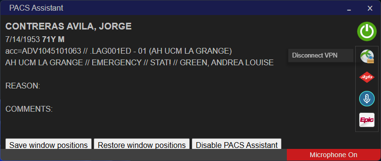

# PACS Assistant

## Introduction

PACS Assistant is intended to make the combination of Agfa Enterprise Imaging (EI), PowerScribe, and Epic work together more seamlessly and efficiently. 

PACS Assistant has multiple functions which are described below. PACS Assistant is highly customizable--most functions can be selectively enabled or disabled.

## Simple sign on

PACS Assistant streamlines PACS start up especially when reading remotely.

At home, clicking the **Power** button and entering a one time passcode will complete the sequence of connecting to the VPN and starting EI, Powerscribe, and Epic. Your username and password are stored securely so you don't have to reenter them every time.

At the hospital, clicking the **Power** button will start EI, Powerscribe, and Epic. On shared workstations, only your username is stored. You will have to provide your password at start up.

At startup, PACS Assistant can reposition EI, Powerscribe, and Epic windows to previously saved positions so you are ready to begin dictating.

## EI, PowerScribe, and Epic window focusing

PACS Assistant lets you treat EI, PowerScribe, and Epic as though they were integrated instead of being three separate applications. By following your mouse on the screen, PACS Assistant keeps the proper application window in focus. No mouse click is necessary.

PACS Assistant treats keyboard input differently according to which window is in focus. For example, if the `C` key is mapped to the EI Caliper tool, then when the mouse is over the EI image windows, pressing `C` will activate the Caliper tool, but when the mouse is over the PowerScribe report window, pressing `C` will type the letter *c*.

Within EI, PACS Assistant helps to keep the correct viewport active. For example, if the `1` key is mapped to window/level preset #1, pressing `1` will change the window/level of the viewport under the mouse, rather than of the last viewport that was active. No additional mouse click is necessary.

In order to enable this functionality, you will need to tell PACS Assistant which keys you have mapped to which tools in EI (one time setup).

## Keyboard shortcuts

PACS Assistant provides several new keyboard shortcuts for working with PowerScribe and EI. These shortcuts are in effect when the mouse over the EI or PowerScribe windows.

### CapsLock key

The **CapsLock** key turns the microphone on and off.

**Shift-CapsLock** signs the report currently being dictated. If there is no current report, then it starts dictation on the next case (i.e. Start reading).

**Ctrl-CapsLock** drafts the current report.

**Shift-Ctrl-CapsLock** makes the current report preliminary.

**Alt-CapsLock** toggles the caps lock state (i.e. the original function of the CapsLock key).

### Tab key

The **Tab** key moves to the next PowerScribe field.

**Shift-Tab** moves to the previous PowerScribe field.

**Ctrl-Tab** moves the cursor to the end of the current line in a report. Pressing it again moves the cursor to the end of the line below.

### ` (backtick or tilde) key

The **`** key switches between the Worklist and Text pages of the EI Desktop.

Shift-`**** switches to the Search page of the EI Desktop. Pressing it again resets the search and puts the cursor in the Patient last name field, ready for you to enter a search.

### Spacebar

The **Spacebar** has a few new functions:

- When the mouse is over the EI image windows, pressing **Spacebar** performs a double-click. This is useful to enlarge/restore the size of a series, or to display a thumbnail in the active viewport.
- When scrolling through an EI image series by holding down the left mouse button and moving the mouse, pressing **Spacebar** engages click lock, allowing the left mouse button to be released while continuing to scroll through images. Pressing **Spacebar** again or clicking either mouse button disengages click lock.
- When the mosue is over the PowerScribe window, 

### Escape key

The **Esc** key closes the current case in EI (i.e. Remove from list) when the mouse is over the EI image windows.

### Ctrl-Z / Ctrl-Y

The **Ctrl-Z** and **Ctrl-Y** keys can be enabled to always send Undo and Redo commands to PowerScribe even when the mouse is over an EI window. This allows quicker editing than needing to move the mouse to the PowerScribe window, and is quicker than using the voice command "Scratch that".

## Adding EI shortcuts

By default EI does not allow some operations to be assigned a keyboard shortcut. PACS Assistant adds this capability for a few such operations.

### Display Study Details

A small icon in the upper right corner of each viewport displays the study report on the EI Desktop Text page when clicked. This function can now be assigned to a keyboard shortcut.

In the most common scenario, pressing the assigned shortcut key will display the report for the comparison study. Pressing the key again toggles to the report of either a second comparison study, or otherwise the empty report of the active study.

## Mouse jiggler

PACS Assistant has a mouse jiggler which can suppress the Windows screensaver and can prevent the screen from turning off.
